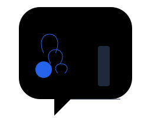

# CastAll

<p align="center">
  
</p>

<p align="center">
  <strong>Instant Browser-Based Wireless Presentation System</strong>
</p>

<p align="center">
  Share your screen to any device instantly — no software installation required.
</p>

<p align="center">
  <a href="#"></a>
  <a href="#"></a>
  <a href="#"></a>
  <a href="#"></a>
  <a href="#"></a>
</p>

---

## Table of Contents

- [Overview](#overview)
- [Key Features](#key-features)
- [Screenshots](#screenshots)
- [Demo](#demo)
- [Technology Stack](#technology-stack)
- [Project Structure](#project-structure)
- [Installation](#installation)
- [Environment Variables](#environment-variables)
- [Usage Guide](#usage-guide)
- [Application Workflow](#application-workflow)
- [Architecture Overview](#architecture-overview)
- [Responsive Design](#responsive-design)
- [Performance](#performance)
- [Security](#security)
- [Accessibility](#accessibility)
- [Browser Support](#browser-support)
- [Scripts](#scripts)
- [Deployment](#deployment)
- [Testing](#testing)
- [Troubleshooting](#troubleshooting)
- [Roadmap](#roadmap)
- [Contributing](#contributing)
- [License](#license)
- [Author](#author)
- [Acknowledgements](#acknowledgements)

---

## Overview

CastAll is a browser-based wireless presentation system that enables instant screen sharing between presenters and viewers using modern web technologies. It eliminates the need for software installation, account creation, or complex setup — users can share their screen or join a presentation in seconds.

### Problem Solved

Traditional screen sharing solutions often require:
- Software installation on all devices
- Account creation and login
- Complex network configuration
- Long room codes or meeting IDs

CastAll solves these problems by providing a simple, browser-based solution with QR code-based room joining and peer-to-peer screen sharing.

### Target Users

- **Presenters** — Lecturers, teachers, meeting hosts, and anyone who needs to share their screen
- **Viewers** — Students, meeting participants, and audience members who need to join a presentation
- **Organizations** — Teams looking for a simple, secure screen sharing solution

---

## Key Features

### Core Features
- **No Installation Required** — Works entirely in the browser
- **QR Code Room Joining** — Scan a QR code to join a presentation instantly
- **Room Code Sharing** — Enter a 6-character room code manually
- **Real-Time Screen Sharing** — Low-latency peer-to-peer streaming via WebRTC
- **Request Approval System** — Hosts approve or reject presentation requests
- **Theme Switching** — Light and dark theme support with persistence
- **Responsive Design** — Optimized for desktop, tablet, and mobile devices
- **Connection Status Indicators** — Visual feedback for connection state
- **Animated Backgrounds** — Physics-based decorative animations
- **Room Expiration** — Automatic cleanup of inactive rooms

### QR Features
- **QR Code Generation** — Automatic QR code generation for each room
- **Camera Scanning** — Live QR code scanning via device camera
- **Image Upload Scanning** — Scan QR codes from uploaded images

### User Experience
- **One-Click Theme Toggle** — Switch between light and dark modes
- **Copy Room Code** — One-click copy to clipboard
- **Exit Button** — Clean session termination
- **Toast Notifications** — Real-time feedback for user actions
- **Before-Unload Warning** — Prevent accidental page closes during active sessions

---

## Screenshots

| Page | Screenshot |
|------|-----------|
| Landing Page |  |
| Host Page |  |
| Share Page |  |
| Presentation Page |  |
| Light Mode |  |
| Dark Mode |  |
| QR Scanner |  |
| Screen Sharing |  |

> Screenshots are placeholders. Replace with actual application screenshots.

---

## Demo

**Live Demo (Coming Soon)**

> Deploy the application and add your live URL here.

---

## Technology Stack

### Frontend
| Technology | Purpose |
|------------|---------|
| React 18 | UI Library |
| TypeScript | Type Safety |
| Vite | Build Tool & Dev Server |
| Tailwind CSS | Utility-First CSS Framework |
| Socket.IO Client | Real-Time Communication |
| html5-qrcode | QR Code Scanning |
| qrcode | QR Code Generation |
| lucide-react | Icon Library |
| sonner | Toast Notifications |
| zod | Schema Validation |
| react-router-dom | Client-Side Routing |
| tailwind-merge | Class Name Merging |
| clsx | Conditional Class Names |

### Backend
| Technology | Purpose |
|------------|---------|
| Node.js | Runtime Environment |
| Express | Web Framework |
| Socket.IO | Real-Time Signaling Server |
| Pino | Structured Logging |
| Helmet | Security Headers |
| CORS | Cross-Origin Resource Sharing |
| nanoid | Unique ID Generation |
| zod | Input Validation |

### Communication
| Technology | Purpose |
|------------|---------|
| WebRTC | Peer-to-Peer Screen Sharing |
| Socket.IO | Signaling & Room Management |

### Development & Build
| Technology | Purpose |
|------------|---------|
| TypeScript | Language |
| ESLint | Code Linting |
| Vite | Frontend Build Tool |
| tsx | Backend Dev Server |
| npm | Package Manager |

---

## Project Structure

```
castall/
├── backend/
│   ├── src/
│   │   ├── config/
│   │   │   └── env.ts              # Environment configuration with zod validation
│   │   ├── constants/
│   │   │   └── index.ts            # Application constants
│   │   ├── errors/
│   │   │   └── appError.ts         # Custom error class
│   │   ├── logger/
│   │   │   └── pino.ts             # Pino logger configuration
│   │   ├── managers/
│   │   │   └── roomManager.ts      # In-memory room state management
│   │   ├── routes/
│   │   │   └── health.ts           # Health check endpoint
│   │   ├── services/
│   │   │   └── roomService.ts      # Room business logic
│   │   ├── sockets/
│   │   │   ├── index.ts            # Socket.IO server setup
│   │   │   └── room.ts             # Room-related socket handlers
│   │   ├── types/
│   │   │   ├── room.ts             # Room type definitions
│   │   │   └── socket.ts           # Socket type definitions
│   │   ├── utils/
│   │   │   ├── codeGenerator.ts    # Room code and session token generation
│   │   │   ├── rateLimiter.ts      # Room creation rate limiting
│   │   │   └── validation.ts       # Input validation schemas
│   │   ├── app.ts                  # Express app configuration
│   │   └── server.ts               # HTTP server entry point
│   ├── .env                        # Environment variables (not committed)
│   ├── .env.example                # Environment template
│   ├── package.json                # Backend dependencies and scripts
│   └── tsconfig.json               # TypeScript configuration
├── frontend/
│   ├── public/
│   │   └── castall-logo.svg        # Application logo
│   ├── src/
│   │   ├── components/
│   │   │   ├── feedback/
│   │   │   │   └── Loading.tsx     # Loading spinner component
│   │   │   ├── presentation/
│   │   │   │   ├── BackgroundEffects.tsx    # Physics-based background animation
│   │   │   │   ├── PresentationScreen.tsx   # Full-screen video display
│   │   │   │   ├── ScreenRecommendation.tsx # Screen sharing recommendation
│   │   │   │   ├── StartSharing.tsx         # Start sharing button/flow
│   │   │   │   └── StopShareButton.tsx      # Stop sharing button
│   │   │   ├── qr/
│   │   │   │   ├── QRCodeCard.tsx           # QR code display component
│   │   │   │   └── QRCodeScanner.tsx        # QR scanner modal (camera + image)
│   │   │   ├── room/
│   │   │   │   ├── HostCard.tsx             # Host room management UI
│   │   │   │   ├── JoinCard.tsx             # Join room form UI
│   │   │   │   └── WaitingForApproval.tsx   # Waiting for approval UI
│   │   │   └── ui/
│   │   │       ├── Button.tsx              # Reusable button component
│   │   │       ├── Card.tsx                # Card container component
│   │   │       ├── ConnectionStatusButton.tsx # Connection status indicator
│   │   │       ├── Input.tsx               # Input field component
│   │   │       └── Spinner.tsx             # Spinner component
│   │   ├── contexts/
│   │   │   ├── RoomContext.tsx       # Room state management
│   │   │   └── ThemeContext.tsx      # Theme state management
│   │   ├── hooks/
│   │   │   ├── useClipboard.ts       # Clipboard copy functionality
│   │   │   ├── useScreenShare.ts     # Screen sharing hook
│   │   │   ├── useSocket.ts          # Socket.IO connection hook
│   │   │   ├── useWebRTC.ts          # WebRTC peer connection hook
│   │   │   └── useWebRTCStats.ts     # WebRTC statistics hook
│   │   ├── layouts/
│   │   │   └── AppLayout.tsx         # Main layout with navbar and theme provider
│   │   ├── lib/
│   │   │   └── utils.ts              # Utility functions (cn, etc.)
│   │   ├── pages/
│   │   │   ├── ErrorPage.tsx         # Error page
│   │   │   ├── HostPage.tsx          # Host/room creation page
│   │   │   ├── LandingPage.tsx       # Landing/home page
│   │   │   ├── PresentationPage.tsx  # Active presentation view
│   │   │   └── SharePage.tsx         # Join room page
│   │   ├── services/
│   │   │   ├── room.ts               # Room API service
│   │   │   ├── socket.ts             # Socket.IO service
│   │   │   └── webrtc.ts             # WebRTC service
│   │   ├── types/
│   │   │   ├── room.ts               # Room type definitions
│   │   │   ├── socket.ts             # Socket type definitions
│   │   │   └── webrtc.ts             # WebRTC type definitions
│   │   ├── utils/
│   │   │   ├── constants.ts          # Application constants
│   │   │   ├── formatters.ts         # Time and room code formatters
│   │   │   └── validators.ts         # Zod validation schemas
│   │   ├── App.tsx                   # Root component with routing
│   │   ├── main.tsx                  # Application entry point
│   │   ├── index.css                 # Global styles and animations
│   │   └── vite-env.d.ts             # Vite type declarations
│   ├── .eslintrc.cjs                 # ESLint configuration
│   ├── index.html                    # HTML entry point
│   ├── package.json                  # Frontend dependencies and scripts
│   ├── postcss.config.js             # PostCSS configuration
│   ├── tailwind.config.ts            # Tailwind CSS configuration
│   ├── tsconfig.json                 # TypeScript configuration
│   └── vite.config.ts                # Vite configuration
├── .env                               # Root environment variables (not committed)
├── .env.example                       # Environment template
├── .gitignore                         # Git ignore rules
├── docker-compose.yml                 # Docker deployment configuration
├── package.json                       # Root workspace configuration
├── package-lock.json                  # Locked dependency versions
└── README.md                          # Project documentation
```

---

## Installation

### Prerequisites

- **Node.js** 18+ and npm
- **Git**

### Setup Steps

1. **Clone the repository**
   ```bash
   git clone <repository-url>
   cd castall
   ```

2. **Install dependencies**
   ```bash
   npm run install:all
   ```

3. **Configure environment variables**
   ```bash
   cp .env.example .env
   ```
   Edit `.env` with your configuration. See [Environment Variables](#environment-variables) for details.

4. **Run development servers**
   ```bash
   npm run dev
   ```
   This starts:
   - Backend server on `http://localhost:3000`
   - Frontend dev server on `http://localhost:5173`

5. **Open the application**
   Navigate to `http://localhost:5173` in your browser.

---

## Environment Variables

### Backend (.env)

| Variable | Description | Default |
|----------|-------------|---------|
| `NODE_ENV` | Application environment | `development` |
| `PORT` | Backend server port | `3000` |
| `FRONTEND_URL` | Frontend application URL | `http://localhost:5173` |
| `STUN_SERVER` | STUN server URL for WebRTC | `stun:stun.l.google.com:19302` |
| `TURN_SERVER` | TURN server URL (optional) | — |
| `TURN_USERNAME` | TURN server username (optional) | — |
| `TURN_PASSWORD` | TURN server password (optional) | — |

### Frontend (Vite environment variables)

| Variable | Description | Default |
|----------|-------------|---------|
| `VITE_STUN_SERVER` | Frontend STUN server URL | `stun:stun.l.google.com:19302` |
| `VITE_TURN_SERVER` | Frontend TURN server URL (optional) | — |
| `VITE_TURN_USERNAME` | Frontend TURN username (optional) | — |
| `VITE_TURN_PASSWORD` | Frontend TURN password (optional) | — |

> **Note:** Never commit `.env` files to version control. Use `.env.example` as a template.

---

## Usage Guide

### Creating a Room (Presenter)

1. Navigate to the application and click **Host Presentation**
2. Enter your device name
3. Click **Create Room**
4. Share the displayed room code or QR code with your audience

### Joining a Room (Viewer)

#### Via QR Code
1. Navigate to the application and click **Share Screen**
2. Click **Scan QR**
3. Choose **Camera Scan** or **Image Upload**
4. Point your camera at the QR code or select a QR code image
5. The room code is automatically decoded and you join the room

#### Via Room Code
1. Navigate to the application and click **Share Screen**
2. Enter your device name and the room code
3. Click **Join Room**

### Screen Sharing

1. As a presenter, create a room and wait for a viewer to join
2. When a viewer joins, you will see an incoming presentation request
3. Click **Accept** to approve the request
4. Click **Start Sharing** and select the screen or window to share
5. The viewer will see your screen in real-time

### Theme Switching

Click the theme toggle button in the top navigation bar to switch between light and dark modes. Your preference is saved automatically.

### Exiting a Session

Click the **Exit** button in the top-right corner to leave the current session and return to the landing page.

---

## Application Workflow

### Presenter Flow

```
Host Presentation → Create Room → Share Code/QR → Wait for Viewer
    → Accept Request → Start Sharing → Present → Stop Sharing → Exit
```

### Viewer Flow

```
Share Screen → Scan QR / Enter Code → Join Room → Wait for Approval
    → View Presentation → Exit
```

### Connection Lifecycle

```
1. Presenter creates room
   ↓
2. Server generates room code and returns to presenter
   ↓
3. Viewer joins room (QR scan or code entry)
   ↓
4. Server emits 'presentation-request' to host
   ↓
5. Host accepts request
   ↓
6. Server generates session token
   ↓
7. WebRTC negotiation begins (SDP offer/answer exchange)
   ↓
8. ICE candidates exchanged
   ↓
9. Peer connection established
   ↓
10. Screen sharing begins
```

---

## Architecture Overview

### System Architecture

```
┌─────────────────┐                           ┌─────────────────┐
│   Presenter     │                           │    Viewer       │
│   (Browser)     │                           │   (Browser)     │
└─────────┬───────┘                           └─────────┬───────┘
          │                                              │
          │          WebRTC (Peer-to-Peer)               │
          │ ─────────────────────────────────────────── │
          │                                              │
          │     Socket.IO Signaling                      │
          +───────────────>  [ Server ]  <──────────────+
                           (Node.js/Express)
```

### Key Components

- **Frontend (React)** — Single-page application with client-side routing
- **Backend (Node.js/Express)** — Lightweight signaling server
- **Socket.IO** — Real-time bidirectional communication for room management and WebRTC signaling
- **WebRTC** — Peer-to-peer media streaming for screen sharing
- **QR System** — QR code generation and scanning for room joining

### Data Flow

1. **Room Creation**: Presenter → Server → Room code + QR returned
2. **Room Joining**: Viewer → Server → Validation → Host notified
3. **Approval**: Host → Server → Session token generated → Viewer notified
4. **WebRTC Negotiation**: SDP offer/answer + ICE candidates exchanged via Socket.IO
5. **Screen Sharing**: Media flows directly between browsers via WebRTC

---

## Responsive Design

CastAll is designed to work seamlessly across a wide range of devices:

| Device | Supported | Notes |
|--------|-----------|-------|
| Mobile | ✅ | Touch-optimized UI, camera QR scanning |
| Tablet | ✅ | Responsive layout, touch-friendly controls |
| Laptop | ✅ | Full feature set, keyboard navigation |
| Desktop | ✅ | Optimal experience, large screen support |
| TV / Large Panel | ✅ | Scalable UI, presentation-friendly |

### Breakpoints
- **sm**: 640px
- **md**: 768px
- **lg**: 1024px

### Responsive Features
- Fluid typography using `clamp()`
- Flexible grid layouts
- Touch-friendly button sizes (minimum 44px)
- Mobile-optimized QR scanner
- Adaptive spacing and padding

---

## Performance

### Implemented Optimizations

- **Peer-to-Peer Streaming** — Media flows directly between browsers, reducing server load
- **60fps Animations** — `requestAnimationFrame` for smooth background animations
- **Container-Aware Boundaries** — `ResizeObserver` for responsive animation limits
- **GPU Acceleration** — `will-change-transform` and `translate3d` for animated elements
- **Efficient Collision Detection** — Squared distance checks to avoid unnecessary square roots
- **Automatic Cleanup** — Expired rooms and streams are automatically cleaned up
- **Lazy Event Cleanup** — Event listeners removed on component unmount
- **Tailwind CSS** — Minimal CSS bundle size with utility-first approach

---

## Security

### Implemented Measures

- **Input Validation** — All Socket.IO events validate input using zod schemas
- **Session Tokens** — Required for WebRTC signaling authorization
- **Security Headers** — Helmet.js sets security headers on all responses
- **CORS Protection** — Configured to allow only the frontend origin
- **Rate Limiting** — Prevents abuse of room creation
- **Input Sanitization** — Device names sanitized before storage
- **Encrypted Media** — WebRTC uses encrypted SRTP for media transport
- **No Sensitive Logging** — Session tokens are truncated in logs
- **Environment Isolation** — Environment variables never committed to git

### Limitations

- No persistent user authentication
- Room state stored in-memory (lost on server restart)
- QR camera scanning requires HTTPS or localhost
- Currently supports one presenter and one viewer per room

---

## Accessibility

CastAll implements the following accessibility features:

- **Semantic HTML** — Proper heading hierarchy and landmark elements
- **ARIA Labels** — Interactive elements include accessible names
- **Keyboard Navigation** — Focus management for interactive components
- **Color Contrast** — Sufficient contrast ratios for text readability
- **Screen Reader Support** — Descriptive labels for dynamic content
- **Reduced Motion** — Respects user preferences for reduced animations

---

## Browser Support

| Browser | Supported | Notes |
|---------|-----------|-------|
| Chrome | ✅ | Full support, recommended |
| Edge | ✅ | Full support |
| Firefox | ✅ | Full support; limited camera QR scanning |
| Safari | ⚠️ | Partial support |
| Mobile Chrome | ✅ | Full support with camera QR scanning |
| Mobile Safari | ⚠️ | Partial support |

### Requirements
- Modern browser with WebRTC support
- HTTPS required for camera access (except localhost)
- JavaScript enabled

---

## Scripts

| Script | Command | Description |
|--------|---------|-------------|
| **Dev** | `npm run dev` | Start backend and frontend dev servers concurrently |
| **Install** | `npm run install:all` | Install all dependencies (root, backend, frontend) |
| **Build** | `npm run build` | Build both backend and frontend for production |
| **Typecheck** | `npm run typecheck` | Run TypeScript type checking on all packages |
| **Lint** | `npm run lint` | Run ESLint on all packages |

### Backend Scripts

| Script | Command | Description |
|--------|---------|-------------|
| Dev | `npm run dev --workspace=backend` | Start backend with hot reload |
| Build | `npm run build --workspace=backend` | Compile TypeScript to JavaScript |
| Start | `npm start --workspace=backend` | Start production backend server |
| Typecheck | `npm run typecheck --workspace=backend` | TypeScript type checking |
| Lint | `npm run lint --workspace=backend` | ESLint code linting |

### Frontend Scripts

| Script | Command | Description |
|--------|---------|-------------|
| Dev | `npm run dev --workspace=frontend` | Start Vite dev server |
| Build | `npm run build --workspace=frontend` | Build for production |
| Preview | `npm run preview --workspace=frontend` | Preview production build locally |
| Typecheck | `npm run typecheck --workspace=frontend` | TypeScript type checking |
| Lint | `npm run lint --workspace=frontend` | ESLint code linting |

---

## Deployment

### Production Build

1. **Build the application**
   ```bash
   npm run build
   ```

2. **Start the backend**
   ```bash
   npm start --workspace=backend
   ```

3. **Serve the frontend**
   Serve the `frontend/dist/` directory using a static file server or reverse proxy.

### Docker Deployment

The project includes Docker configuration for containerized deployment:

```bash
docker-compose up --build
```

This starts:
- Frontend on port 5173
- Backend on port 3000
- Nginx reverse proxy on ports 80/443

### Production Considerations

- **HTTPS** — Required for WebRTC and camera access
- **TURN Server** — Configure for production WebRTC reliability
- **Process Manager** — Use PM2 or similar for backend process management
- **Reverse Proxy** — Nginx or similar for static assets and SSL termination
- **Environment Variables** — Configure all required variables in production `.env`
- **CORS** — Update `FRONTEND_URL` to match production domain

---

## Testing

CastAll currently uses manual testing for verification:

- **TypeScript Compilation** — Type-level testing via `tsc`
- **ESLint** — Code quality and style enforcement
- **Manual Testing** — WebRTC flows, QR scanning, UI interactions

### Recommended Testing Additions

- Unit tests for utility functions and validation schemas
- Integration tests for Socket.IO event handlers
- E2E tests for critical user flows

---

## Troubleshooting

### Cannot Create Room

**Problem:** Room creation fails or times out

**Solutions:**
- Check your internet connection
- Ensure the backend server is running on port 3000
- Verify `FRONTEND_URL` is correctly configured in `.env`
- Check browser console for error messages

### Cannot Join Room

**Problem:** Unable to join an existing room

**Solutions:**
- Verify the room code is correct
- Check that the room has not expired (15-minute timeout)
- Ensure the presenter has approved your request
- Verify Socket.IO connection is established

### Screen Share Not Working

**Problem:** Screen sharing fails or shows no video

**Solutions:**
- Grant screen sharing permission when prompted by the browser
- Ensure you are using a supported browser (Chrome, Edge, Firefox)
- Check WebRTC connection status in the browser console
- Verify STUN/TURN server configuration

### QR Code Not Scanning

**Problem:** Camera scanner cannot detect QR code

**Solutions:**
- Ensure adequate lighting
- Hold the camera steady and at an appropriate distance
- Try using Image Upload instead of Camera Scan
- Ensure the QR code is a valid CastAll room code
- Check camera permissions in browser settings

### High Latency

**Problem:** Screen sharing is laggy or delayed

**Solutions:**
- Check network conditions on both presenter and viewer sides
- Configure a TURN server for better connectivity
- Reduce screen resolution or frame rate in browser settings
- Close unnecessary applications consuming bandwidth

---

## Roadmap

### Implemented Features
- ✅ Browser-based screen sharing with WebRTC
- ✅ QR code generation and scanning (camera + image)
- ✅ Room management with unique codes
- ✅ Request approval system
- ✅ Light/dark theme with persistence
- ✅ Responsive design for all device sizes
- ✅ Physics-based background animations
- ✅ Connection status indicators
- ✅ Toast notifications
- ✅ Rate limiting
- ✅ Input validation
- ✅ Security headers
- ✅ Structured logging

### Future Enhancements
- 🔄 Multiple viewer support in a single room
- 🔄 Persistent room storage with database
- 🔄 User authentication and accounts
- 🔄 Screen annotation and whiteboard tools
- 🔄 Presentation recording and playback
- 🔄 Progressive Web App (PWA) support
- 🔄 Custom branding for organizations
- 🔄 Analytics and usage metrics
- 🔄 Chat and communication features
- 🔄 Room scheduling and calendar integration

---

## Contributing

Contributions are welcome! Please follow these guidelines:

1. **Fork the repository**
2. **Create a feature branch**
   ```bash
   git checkout -b feature/your-feature-name
   ```
3. **Make your changes** following the project's coding standards
4. **Run linting and type checking**
   ```bash
   npm run lint
   npm run typecheck
   ```
5. **Commit your changes** with a descriptive commit message
6. **Push to your fork**
7. **Create a Pull Request**

### Coding Standards

- Follow TypeScript strict mode
- Use ESLint for code linting
- Follow existing naming conventions
- Keep components small and focused
- Write clear, self-documenting code

---

## License

This project is licensed under the MIT License. See the [LICENSE](LICENSE) file for details.

> If no LICENSE file exists, add one or update this section with the correct license information.

---

## Author

**Dipesh Rijal**

- GitHub: [@DipeshR23](https://github.com/DipeshR23)
- LinkedIn: [linkedin.com/in/dipeshrijal](https://linkedin.com/in/dipeshrijal)
- Portfolio: [dipeshrijal.com.np](https://dipeshrijal.com.np)
- Email: dipeshrijal@gmail.com

---

## Acknowledgements

CastAll is built with the following open-source technologies:

- [React](https://react.dev/) — UI library
- [TypeScript](https://www.typescriptlang.org/) — Type safety
- [Vite](https://vitejs.dev/) — Build tool
- [Tailwind CSS](https://tailwindcss.com/) — CSS framework
- [Socket.IO](https://socket.io/) — Real-time communication
- [WebRTC](https://webrtc.org/) — Peer-to-peer media streaming
- [html5-qrcode](https://github.com/mebjas/html5-qrcode) — QR code scanning
- [qrcode](https://github.com/soldair/node-qrcode) — QR code generation
- [lucide-react](https://lucide.dev/) — Icon library
- [sonner](https://sonner.emilkowal.ski/) — Toast notifications
- [zod](https://zod.dev/) — Schema validation
- [Express](https://expressjs.com/) — Web framework
- [Pino](https://getpino.io/) — Logger
- [Helmet](https://helmetjs.github.io/) — Security headers
- [nanoid](https://github.com/ai/nanoid) — ID generation

---

<p align="center">
  Made with ❤️ by <a href="https://github.com/DipeshR23">Dipesh Rijal</a>
</p>
